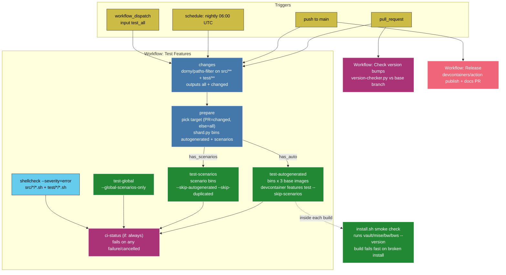
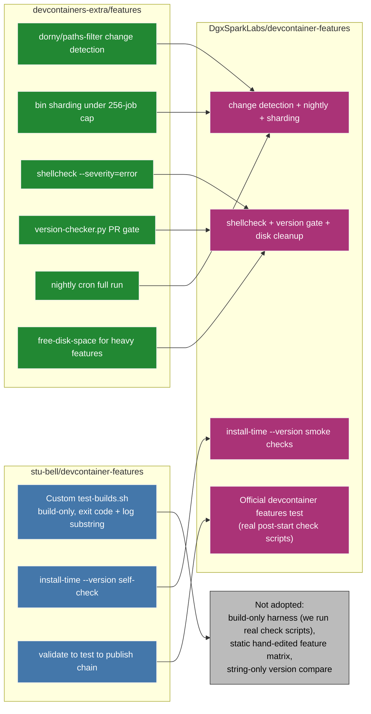

# CI/CD Pipeline

This repository's continuous integration answers one question on every change:
**"Does each Dev Container Feature still install and behave correctly, and is it
safe to publish?"** The pipeline borrows the strongest practices observed in two
community Feature repositories and adapts them to this repo's conventions.

## How This Repo Tests Features

The `Test Features` workflow (`.github/workflows/test.yaml`) is change-aware,
sharded, and gated behind a single aggregate status check. A separate PR gate
enforces version bumps, and release publishing runs only from `main`.

Change detection keeps pull requests fast by testing only the features whose
`src/` or `test/` files moved, while the nightly `schedule` run and pushes to
`main` test every feature. The nightly run is the safety net for this repo in
particular: `vault`, `bitwarden-cli`, and `bitwarden-secrets-manager` all fetch
from external sources (the HashiCorp and GitHub release APIs, moving download
URLs), so upstream drift can break an install with no code change here.

### Mechanisms and Where They Live

| Mechanism | Location | Purpose |
| --- | --- | --- |
| Change detection | `test.yaml` job `changes` (`dorny/paths-filter`) | Test only changed features on a PR |
| Nightly full run | `test.yaml` `schedule` cron | Catch upstream drift with no code change |
| Matrix sharding | `.github/scripts/shard.py` | Round-robin features into bins under the 256-job cap |
| Autogenerated tests | `test.yaml` job `test-autogenerated` | Install each feature on three base images |
| Scenario tests | `test.yaml` job `test-scenarios` | Exercise options and configured servers |
| Global scenarios | `test.yaml` job `test-global` | Cross-feature global scenarios |
| Shell lint | `test.yaml` job `shellcheck` | Fail on shell errors before a container build |
| Disk cleanup | `test.yaml` step `Free disk space` | Reclaim runner disk for heavy features (wired, empty list today) |
| Aggregate gate | `test.yaml` job `ci-status` | One required check; unmasked failures propagate |
| Version-bump gate | `.github/scripts/version-checker.py`, `version-check.yaml` | Block a changed feature that forgot to bump its version |
| Install smoke check | each `src/*/install.sh` | Fail the build if the binary is not runnable |

## Where These Ideas Came From

Two community repositories anchor the design. The comparison below names what
each contributed and what this repo deliberately did not copy.

`devcontainers-extra` contributed the production-scale machinery: change
detection, sharding, `shellcheck`, the nightly run, the version-bump gate, and
conditional disk cleanup. `stu-bell` contributed the install-time `--version`
self-check and the validate-then-publish discipline. This repo keeps the
official `devcontainer features test` runner, which starts the container and runs
each feature's post-start `check` assertions, so it does not adopt `stu-bell`'s
build-only harness. The ported version comparison uses numeric component tuples
(`1.10.0` sorts above `1.9.0`) rather than the string comparison in the original.
